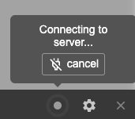
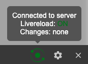
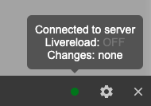
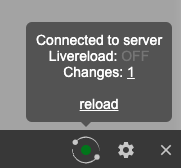
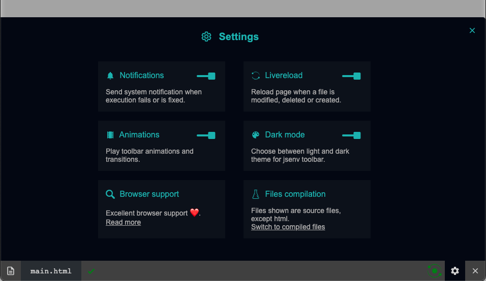
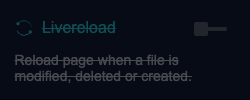
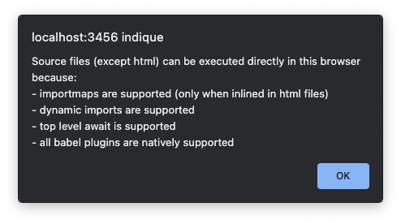
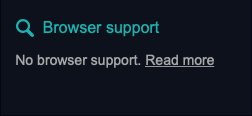
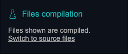
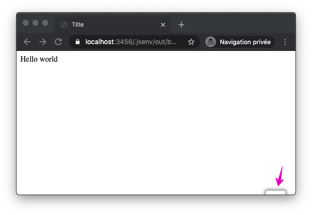

# Jsenv dev server

This is an in-depth documentation about jsenv dev server. For a quick overview go to [dev server overview](../../readme.md#Dev-server-overview).

This documentation list [key features](#key-features) and gives the [definition of a dev server for jsenv](#Definition-of-a-dev-server-for-jsenv) to get an idea of how things where designed. Then it documents [startDevServer](#startDevServer) function, its parameters and return value. Finally you can find:

# Key features

- Any html file can become an entry point
- Files are compiled only if browser needs it
- Server uses filesystem as cache for compiled files
  - You can see compiled files with your own eyes
  - Files are recompiled only if they changed, otherwise cache is used
- Livereloading: Page auto reload when you save a file

# Definition of a dev server for jsenv

Frontend projects often comes with a local server running on your machine.

These type of servers focuses on development. During development files change often and developper want a fast feedback to see effects of thoose changes.

# startDevServer

`startDevServer` is an async function starting a development server. This development server consider that more than one html file in your project can be an entry point. You can use it to debug a file in isolation, create a storybook and so on.

```js
import { startDevServer } from "@jsenv/core"

startDevServer({
  projectDirectoryUrl: "file:///Users/you/project/",
  explorableConfig: {
    source: {
      "src/**/*.html": true,
      "src/whatever/**/*.html": false,
    },
  },
})
```

— source code at [src/startDevServer.js](../../src/startDevServer.js).

## explorableConfig

`explorableConfig` parameter is an object used to configure what files are explorable in your project. This is an optional parameter with a default value configured to match list a subset of html files. The exact value can be found in [src/jsenvExplorableConfig.js](../../src/jsenvExplorableConfig.js).

This parameter must be an object composed of other objects where keys are relative or absolute urls. These urls are allowed to contain `*` and `**` that will be used for pattern matching as documented in https://github.com/jsenv/jsenv-url-meta#pattern.

Each group declared in `explorableConfig` are turned into tabs in jsenv exploring index page. These tabs are here to regroup files that goes together.
For instance you might want to have a tab for source files and one for test files.


## livereloading

`livereloading` parameter is a boolean controlling if the browser will auto reload when a file is saved. This is an optional parameter enabled by default.

Any request to a file inside your project is also considered as a dependency that can triggers a reload. It means if your html file or js file load assets such as image or css these asset files will also trigger livereloading when saved.

## watchConfig

`watchConfig` parameter is an object configuring which files are watched to trigger livereloading. This is an optional parameter with a default value configured to watch everything except git and node_modules directories. `watchConfig` reuse [explorableConfig](#explorableConfig) shape meaning keys are urls with pattern matching.

_A custom `watchConfig` to watch only index.html and files inside src directory_

```js
{
  "./index.html": true,
  "./src/**/*": true,
}
```

## jsenvToolbar

`jsenvToolbar` parameter is a boolean controlling if a script loading jsenv toolbar will be injected into html files. This parameter is optional and enabled by default.

The image below is a screenshot of this toolbar.


For more details check [jsenv toolbar](#jsenv-toolbar) section.

## Server parameters

Server parameters are configured to let you use start a server right away. You might want to configure some of them to use a specific port or your own https certificate.

The following parameter controls the server:

- [protocol](../shared-parameters.md#protocol)
- [privateKey](../shared-parameters.md#privateKey)
- [certificate](../shared-parameters.md#certificate)
- [ip](../shared-parameters.md#ip)
- [port](../shared-parameters.md#port)
- [logLevel](../shared-parameters.md#logLevel)

## Shared parameters

There is more parameters listed here. Their documentation is regrouped in an other section.

- [projectDirectoryUrl](../shared-parameters.md#projectDirectoryUrl)
- [babelPluginMap](../shared-parameters.md#babelPluginMap)
- [customCompilers](../shared-parameters.md#customCompilers)
- [importDefaultExtension](../shared-parameters.md#importDefaultExtension)
- [jsenvDirectoryRelativeUrl](../shared-parameters.md#jsenvDirectoryRelativeUrl)

# startDevServer return value

Using the return value is an advanced use case, in theory you should not need this. `startDevServer` returns a _server object_ created by `@jsenv/server`. You can read [@jsenv/server documentation](https://github.com/jsenv/server/blob/main/docs/all_the_rest.md#startserver-return-value) to know more about the _server object_ composition.

Code below shows how you might use return value.

```js
import { startDevServer } from "@jsenv/core"

const server = await startDevServer({
  projectDirectoryUrl: new URL("./", import.meta.url),
})

server.stop()
```

# jsenv toolbar

The jsenv toolbar is injected at the bottom of the page by the exploring server. It is inside an iframe so it cannot conflict with your css or js.

The toolbar is composed as shown:


## Exploring index button

This button is convenient to go back to exploring index.

## File indicator

This component displays the file being executed as an url relative to your project directory.

## Execution indicator

This component is an icon representing the html file execution state. The icon can be clicked to get more information and can be in the following states:

| State     | Screenshot                                                           | Description                                                        |
| --------- | -------------------------------------------------------------------- | ------------------------------------------------------------------ |
| executing |    | html file assets and imports are being loaded, parsed and executed |
| failed    |        | a script with type module in the html file has thrown an error     |
| completed |  | html file execution is done without error                          |

## Server connection indicator

This component is an icon representing the dev server connection state. The icon can be clicked to get more information and can be in the following states.

| State                             | Screenshot                                                                                  | Description                                                                                                            |
| --------------------------------- | ------------------------------------------------------------------------------------------- | ---------------------------------------------------------------------------------------------------------------------- |
| connecting                        |                                            | Jsenv toolbar is connecting to the server server                                                                       |
| disconnected                      |                              | Happens after you click cancel button in previous state                                                                |
| failed                            |                               | Jsenv toolbar cannot connect to the server. You should check the terminal where server was started                     |
| connected with livereloading      |         | Jsenv toolbar is connected to the server and will autoreload on save                                                   |
| connected without livereloading   |  | Jsenv toolbar is connected to the server but won't autoreload on save. Happens if your disable livereload in settings. |
| connected without livereloading 2 |     | As previous state + you saved one file while livereload is disabled.                                                   |

## Settings button

This component is a button opening a setting panel when clicked. Each setting is saved in the browser localStorage.



## Notification switch

Control if a notification is shown when file execution fails, is still failing or is fixed.

## Livereload switch

Useful to disable temporarily livereload for any legit reason you may have.

If livereload is fully disabled using [livereloading](#livereloading) parameter, this switch cannot be used and looks as below:



## Animations switch

Toolbar has a few animations, mostly when it's opened or closed. If animations bothers you they can be disabled with this switch.

## Dark mode switch

Toogle between dark theme and light theme. Use this to keep a good contrast between the toolbar and the website behind it.

## Browser support

When browser support is good enough and if he code you write is standard js, html and css, jsenv dev server will serve the source files **without compilation step**. The browser support section informs you if that is possible or not. You can click "Read more" to get more information in an alert dialog.

| State     | Screenshot                                                               | Description                                                                | Alert screenshot                                                                        |
| --------- | ------------------------------------------------------------------------ | -------------------------------------------------------------------------- | --------------------------------------------------------------------------------------- |
| Excellent |  | The browser support all features except remote importmap files             |  |
| No        |                | The browser is missing some/all important features such as top level await |                   |

## Files compilation

As explained in [Browser support](#Browser-support) jsenv dev server might use source files directly. The files compilation section informs you if files are compiled and allows you to switch between source files and compiled files.

| Compiled? | Screenshot                                                         |
| --------- | ------------------------------------------------------------------ |
| No        |  |
| Yes       |     |

An other way to see if files are compiled or not is to check the browser url.

| Compiled? | Browser url                                                           |
| --------- | --------------------------------------------------------------------- |
| No        |  |
| Yes       |     |

## Close button

This button closes the toolbar to keep only the website. The toolbar can be shown back using a discrete box at the bottom right.



When you close toolbar this information is kept in browser localStorage to keep it hidden after reloading.
