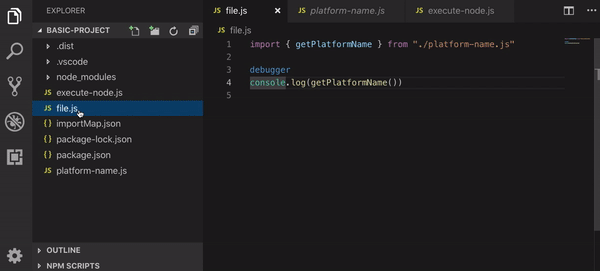

# execution

This feature is provided by `@jsenv/core` which exports a function called `execute`.<br />

It is a function that will launch a browser or a node.js process to execute a file inside it.
It dynamically transforms file source to make it executable on the platform.

This documentation explains how to use `execute` inside a project.

## How to use

Using a basic project setup we'll see how to use `execute` to create script capable to execute file inside chromium or node.js.

### Basic project setup

1. Create a file structure like this one

```
root/
  src/
    file.js
    platform-name.js
  package.json
```

`root/file.js`

```js
import { getPlatformName } from "./platform-name.js"

console.log(getPlatformName())
```

`root/platform-name.js`

```js
export const getPlatformName = () => {
  if (typeof window === "object") return "browser"
  if (typeof global === "object") return "node"
  return "other"
}
```

`root/package.json`

```json
{
  "name": "whatever"
}
```

2. Install dev dependencies

```shell
npm install --save-dev @jsenv/core @jsenv/chromium-launcher @jsenv/node-launcher
```

3. Generate `root/importMap.json`

```shell
npm install --save-dev @jsenv/node-module-import-map@2.1.0
node -e "require('@jsenv/node-module-import-map').generateImportMapForProjectNodeModules({ projectPath: process.cwd() });"
```

### How to execute a file of that basic project inside chromium

1. Create a script capable to execute a file on chromium.<br />

`root/execute-chromium.js`

```js
const { execute } = require("@jsenv/core")
const { launchChromium } = require("@jsenv/chromium-launcher")

execute({
  projectPath: __dirname,
  launch: launchChromium,
  fileRelativePath: `/${process.argv[2]}`,
})
```

2. Run `root/execute-chromium.js` you just created

```shell
node ./execute-chromium.js src/file.js
```

`browser` will be logged in your terminal.

### How to execute a file of that basic project inside node.js

1. Create a script capable to execute a file on node.<br />

`root/execute-node.js`

```js
const { execute } = require("@jsenv/core")
const { launchNode } = require("@jsenv/node-launcher")

execute({
  projectPath: __dirname,
  launch: launchNode,
  fileRelativePath: `/${process.argv[2]}`,
})
```

2. Run `root/execute-node.js` you just created

```shell
node ./execute-node.js src/file.js
```

`node` will be logged in your terminal.

## `execute` return value

`execute` return value example

```json
{
  "status": "completed",
  "namespace": {
    "default": 42
  }
}
```

## `execute` options

### launch

```js
const { launchChromium } = require('@jsenv/core')

execute({
  projectPath: '/Users/you/project'
  fileRelativePath: `/index.js`,
  launch: launchChromium,
})
```

This option is **required**.<br />
It is a function capable to launch a platform to execute a file inside it.
You're not likely going to write your own `launch` function, jsenv provides them.<br />
— see [platform launcher](../platform-launcher/platform-launcher.md)

### fileRelativePath

```js
import { execute } from '@jsenv/core'
import { launchNode } from '@jsenv/node-launcher'

execute({
  projectPath: '/Users/you/project'
  fileRelativePath: `/index.js`,
  launch: launchNode,
})
```

This option is **required**.<br />
It is a string leading to the file you want to execute.<br />
It is relative to `projectPath`.

### mirrorConsole

```js
import { execute } from '@jsenv/core'
import { launchNode } from '@jsenv/node-launcher'

execute({
  projectPath: '/Users/you/project'
  fileRelativePath: `/index.js`,
  launch: launchNode,
  mirrorConsole: true
})
```

When true, logs of the launched browser or node process will also be logged in your terminal.

If you don't pass this option, the default value will be:

```js
true
```

### stopOnceExecuted

```js
import { execute } from '@jsenv/core'
import { launchNode } from '@jsenv/node-launcher'

execute({
  projectPath: '/Users/you/project'
  fileRelativePath: `/index.js`,
  launch: launchNode,
  stopOnceExecuted: true
})
```

When true, the platform will be stopped once the file execution is done.

This option kills the browser or node process when the file execution is done. This option is used by unit tests for instance that does not want to keep things alive.

If you don't pass this option, the default value will be:

```js
false
```

### projectPath

— see [generic documentation for projectPath](../shared-options/shared-options.md#projectpath)

### babelPluginMap

— see [generic documentation for babelPluginMap](../shared-options/shared-options.md#babelpluginmap)

### importMapRelativePath

— see [generic documentation for importMapRelativePath](../shared-options/shared-options.md#importmaprelativepath)

### importDefaultExtension

— see [generic documentation for importDefaultExtension](../shared-options/shared-options.md#importdefaultextension)

### compileIntoRelativePath

— see [generic documentation for compileIntoRelativePath](../shared-options/shared-options.md#compileintorelativepath)

#### Use `execute` to debug file withing vscode

What if you could debug inside node.js the file currently opened in vscode?<br />

1. Add a launch configuration in `root/.vscode/launch.json`

```json
{
  "version": "0.2.0",
  "configurations": [
    {
      "name": "jsenv-node",
      "type": "node",
      "request": "launch",
      "protocol": "inspector",
      "program": "${workspaceFolder}/execute-node.js",
      "args": ["${relativeFile}"],
      "autoAttachChildProcesses": true,
      "sourceMaps": true,
      "sourceMapPathOverrides": {
        "/*": "${workspaceFolder}/*"
      },
      "smartStep": true,
      "skipFiles": ["node_modules/**", "<node_internals>/**/*.js"]
    }
  ]
}
```

2. Start a debugging session using `jsenv node`

I made a video of the debugging session inside vscode. The gif below was generated from that video.



# End

You've reached the end of this documentation, congrats for scrolling so far.<br />
Let me suggest you to:

- take a break, reading doc or scrolling can be exhausting :)
- [go back to readme](../../README.md#how-to-use)
- [go to next doc on testing](../testing/testing.md)

If you noticed issue in this documentation, you're very welcome to open [an issue](https://github.com/jsenv/jsenv-core/issues). I would love you even more if you [create a pull request](https://github.com/jsenv/jsenv-core/pulls) to suggest an improvement.
