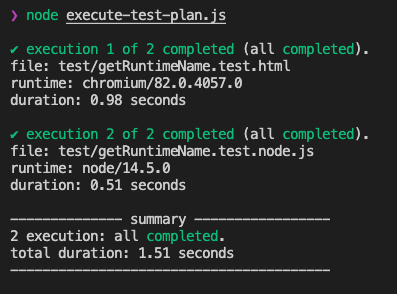
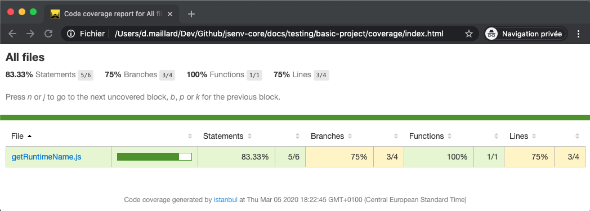
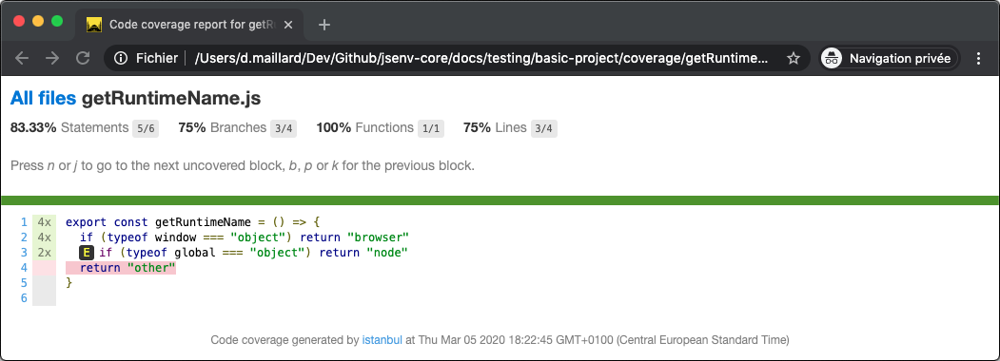

# Table of contents

- [Test presentation](#Test-presentation)
- [Test execution](#Test-execution)
  - [How test is executed](#How-test-is-executed)
  - [Execution error](#Execution-error)
  - [Execution timeout](#Execution-timeout)
  - [Execution disconnection](#Execution-disconnection)
  - [Execution completion](#Execution-completion)
  - [How to test async code](#How-to-test-async-code)
- [executeTestPlan example](#executeTestPlan-example)
- [executeTestPlan parameters](#executeTestPlan-parameters)
  - [testPlan](#testPlan)
  - [executionDefaultOptions](#executionDefaultOptions)
  - [completedExecutionLogAbbreviation](#completedExecutionLogAbbreviation)
  - [completedExecutionLogMerging](#completedExecutionLogMerging)
  - [concurrencyLimit](#concurrencyLimit)
  - [coverage parameters](#coverage-parameters)
  - [Shared parameters](#shared-parameters)
- [executeTestPlan return value](#executeTestPlan-return-value)
  - [testPlanSummary](#testPlanSummary)
  - [testPlanReport](#testPlanReport)
  - [testPlanCoverageMap](#testPlanCoverageMap)
- [Test concrete example](#Test-concrete-example)
  - [1 - Setup basic project](#1---setup-basic-project)
  - [2 - Execute tests](#2---execute-tests)
  - [3 - Generate test coverage](#3---generate-test-coverage)

# Test presentation

A test runs your code to ensure it works as expected.

Test are putting you in the shoes of someone using your code. In that perspective they document how to use your code and the variety of scenarios your code supports.<br />
Finally testing mitigates the risk of breaking in the future what is working today.

Jsenv provides an api to execute your test files inside one or many environments. It means you can execute a given test file inside chromium and Node.js as long as code inside test file can executes in both.

# Test execution

Each test file will be executed in his own browser or node.js process. It reduces chances that a file execution have a side effect on an other file execution. For example if a test file creates an infinite loop, only this test file will be considered failing and other test can keep going.

jsenv provides several test execution environments, called `runtime`.

- A chromium browser per test
- A chromium browser tab per test
- A firefox browser per test
- A firefox tab per test
- A webkit browser per test
- A webkit tab per test
- A node process per test

## How test is executed

Test is executed by something equivalent to a dynamic import.

```js
await import("file:///file.test.js")
```

If dynamic import resolves, execution is considered successfull.<br />
If dynamic import rejects, execution is considered errored.<br />
If dynamic import takes too long to settle, execution is considered timedout.<br />

Once the execution becomes either successfull, errored or timedout jsenv stops the runtime launched to execute the test. Inside a node process there is a special behaviour where jsenv sends `SIGTERM` signal to the node process executing your test. After 8s, if the node process has not exited by its own it is killed by force.


## Execution error

Any value thrown during file execution sets execution status to errored and test is considered as failed.

```js
throw new Error("here")
```

## Execution timeout

Execution taking longer than an allocated amout of milliseconds sets execution status to timedout and test is considered as failed.

```js
await new Promise(() => {})
```

Note: By default an execution is given 30s before being considered as a timeout.
Check [executionDefaultOptions](#executionDefaultOptions) to know how to configure this value.

## Execution disconnection

Runtime disconnected during file execution sets execution status to disconnected and test is considered as failed.

```js
while (true) {}
```

Note: There is, fortunately, no way to crash a browser during execution so this code might either crash the runtime or result in a timeout. Inside node however you could write code resulting in a disconnected execution.

```js
process.exit()
```

## Execution completion

When none of the aboves scenario occurs, execution status is success and test is considered as completed.

```js
const actual = 10 + 10
const expected = 20
if (actual !== expected) {
  throw new Error(`10 + 10 should be 20`)
}
```

Note: An empty file is a completed test.

## How to test async code

Top level await is a standard (and damn cool) way to make your top level code execution asynchronous. Use it to test async code.

```js
const actual = await Promise.resolve(42)
const expected = 42
if (actual !== expected) throw new Error("should be 42")
```

Without top level await your execution is considered done while your code is still executing.

```js
console.log("execution start")
;(async () => {
  const actual = await Promise.resolve(42)
  const expected = 42
  if (actual !== expected) throw new Error("should be 42")
  console.log("test done")
})()
console.log("execution end")
```

Logs

```console
execution start
execution end
test done
```

If jsenv executed that code, runtime would be stopped after `execution end` logs and `test done` would never happen.

# executeTestPlan example

`executeTestPlan` is an async function executing test files in one or several runtime environments logging progression and optionnaly generating associated coverage.
To integrate it properly in your own project, take inspiration from the [basic project](./basic-project) files.

```js
import { executeTestPlan, launchNode } from "@jsenv/core"

executeTestPlan({
  projectDirectoryUrl: new URL("./", import.meta.url),
  testPlan: {
    "./test/**/*.test.js": {
      node: {
        launch: launchNode,
        allocatedMs: 5000,
      },
    },
  },
  logLevel: "info",
  coverage: true,
  coverageConfig: {
    "./index.js": true,
    "./src/**/*.js": true,
    "./**/*.test.*": false,
  },
  coverageJsonFile: true,
  coverageJsonFileRelativeUrl: "./coverage/coverage.json",
})
```

— source code at [src/executeTestPlan.js](../../src/executeTestPlan.js).

# executeTestPlan parameters

`executeTestPlan` uses named parameters documented here.

Each parameter got a dedicated section to shortly explain what it does and if it's required or optional.

## testPlan

`testPlan` is an object describing where are your test files and how they should be executed. This is an optional parameter with a default value of:

```js
{
  "./test/**/*.test.js": {
    node: {
      launch: launchNode
    }
  }
}
```

`testPlan` parts are named `specifier`, `filePlan`, `executionName` and `executionOptions`.<br />
To better see what is named how, let's name every part of the default `testPlan`:

```js
const specifier = "./test/**/*.test.js"
const executionName = "node"
const executionOptions = {
  launch: launchNode,
}
const filePlan = {
  [executionName]: executionOptions,
}
const testPlan = {
  [specifier]: filePlan,
}
```

### specifier

`specifier` is documented in [https://github.com/jsenv/jsenv-url-meta#specifier](https://github.com/jsenv/jsenv-url-meta#specifier).

### executionName

`executionName` can be anything. up to you to name this execution.

### executionOptions

`executionOptions` can be `null`, in that case the execution is ignored.
It exists to prevent an execution planified by a previous specifier.

```js
{
  // execute every file twice on node (why not ^^)
  "./test/**/*.test.js": {
    node: {
      launch: launchNode,
    },
    node2: {
      launch: launchNode
    }
  },
  // but executes foo.test.js once
  "./test/foo.test.js": {
    node2: null
  }
}
```

`executionOptions` option are documented below:

#### launch

A function capable to launch a runtime. This parameter is **required**, the available launch functions are documented in [launcher](../launcher.md) documentation.

#### allocatedMs

A number representing the amount of milliseconds allocated for this file execution to complete. This option is optional with a default value of 30s.

#### measureDuration

A boolean controlling if file execution duration is measured and reported back. This parameter is optional with a default value of true.

When true `startMs`, `endMs` properties are availabe on every execution result inside [testPlanReport](#testPlanReport)

#### captureConsole

A boolean controlling if console logs are captured during file execution and reported back. This parameter is optional with a default value of true.

When true `consoleCalls` property is availabe on every execution result inside [testPlanReport](#testPlanReport)

#### collectCoverage

A boolean controlling if coverage related to this execution is collected and reported back. This parameter is optional with a default value of false.

When true `coverageMap` property is availabe on every execution result inside [testPlanReport](#testPlanReport)

#### logSuccess

A boolean controlling if execution success is logged in your terminal. This parameter is optional with a default value of true.

When false and execution completes normally nothing is logged.

## executionDefaultOptions

`executionDefaultOptions` parameter is an object that will be the default option used to execute file. This is an optional parameter with a default value of `{}`.

`executionDefaultOptions` was designed to define options shared by file execution. These option can be overriden per file using [testPlan](#testPlan) parameter.

For example the following code allocates 5s test file by default and 10s for `foo.test.js`

```js
executeTestPlan({
  executionDefaultOptions: {
    allocatedMs: 5000,
  },
  testPlan: {
    "./foo.test.js": {
      node: {
        launch: launchNode,
        allocatedMs: 10000,
      },
    },
  },
})
```

## completedExecutionLogAbbreviation

`completedExecutionLogAbbreviation` parameter is a boolean controlling verbosity of completed execution logs. This parameter is optional and disabled by default.


Becomes


> Note how completed executions are shorter. The idea is that you don't need additional information for completed executions.

## completedExecutionLogMerging

`completedExecutionLogMerging` parameter is a boolean controlling if completed execution logs will be merged together when adjacent. This parameter is optional and disabled by default.


Becomes


> Note how the first two completed execution got merged into one line. The idea is to reduce output length as long as execution are completed.

## concurrencyLimit

`concurrencyLimit` parameter is a number representing the max amount of execution allowed to run simultaneously. This parameter is optional with a default value being the number of cpus available minus one. To ensure one execution at a time you can pass `1`.

## coverage parameters

### coverage

`coverage` parameter is a boolean used to enable coverage or not while executing test files. This parameter is enabled if node process args includes `--coverage`.

#### coverageConfig

`coverageConfig` parameter is an object used to configure which files must be covered. This parameter is optional with a default value exported by [src/jsenvCoverageConfig.js](../../src/jsenvCoverageConfig.js). Keys are specifiers as documented in [https://github.com/jsenv/jsenv-url-meta#specifier](https://github.com/jsenv/jsenv-url-meta#specifier).

### coverageIncludeMissing

`coverageIncludeMissing` parameter is a boolean used to controls if testPlanCoverageMap will generate empty coverage for file never imported by test files. This parameter is optional and enabled by default.

### coverageAndExecutionAllowed

`coverageAndExecutionAllowed` parameter is a boolean controlling if files can be both executed and instrumented for coverage. A test file should not appear in your coverage but if `coverageConfig` include your test files for coverage they would. This parameter should help to prevent this to happen in case you missconfigured `coverageConfig` or `testPlan`. This parameter is optional and enabled by default.

### coverageTextLog

`coverageTextLog` parameter is a boolean controlling if the coverage will be logged to the console after test plan is fully executed. This parameter is optional and enabled by default.

### coverageJsonFile

`coverageJsonFile` parameter is a boolean controlling if a json file containing your test plan coverage will be written after test plan is fully executed. This parameter is optional and enabled by default when `process.env.CI` is truthy.

### coverageJsonFileLog

`coverageJsonFileLog` parameter is a boolean controlling if the json file path for coverage will be logged to the console. This parameters is optional and enabled by default.

### coverageJsonFileRelativeUrl

`coverageJsonFileRelativeUrl` parameter is a string controlling where the json file for coverage will be written. This parameter is optional with a default value of `"./coverage/coverage.json"`.

### coverageHtmlDirectory

`coverageHtmlDirectory` parameter is a boolean controlling if a directory with html files showing your coverage will be generated. This parameter is optional and enabled by default when `process.env.CI` is falsy.

### coverageHtmlDirectoryRelativeUrl

`coverageHtmlDirectoryRelativeUrl` parameter is a string controlling where the directory with html files will be written. This parameter is optional with a default value of `./coverage/`.

### coverageHtmlDirectoryIndexLog

`coverageHtmlDirectoryIndexLog` parameter is a boolean controlling if the html coverage directory index file path will be logged to the console. This parameter is optional and enabled by default.

## Shared parameters

To avoid duplication some parameter are linked to a generic documentation.

- [projectDirectoryUrl](../shared-parameters.md#projectDirectoryUrl)
- [babelPluginMap](../shared-parameters.md#babelPluginMap)
- [convertMap](../shared-parameters.md#convertMap)
- [importDefaultExtension](../shared-parameters.md#importDefaultExtension)
- [compileServerLogLevel](../shared-parameters.md#compileServerLogLevel)
- [compileServerProtocol](../shared-parameters.md#compileServerProtocol)
- [compileServerPrivateKey](../shared-parameters.md#compileServerPrivateKey)
- [compileServerCertificate](../shared-parameters.md#compileServerCertificate)
- [compileServerIp](../shared-parameters.md#compileServerIp)
- [compileServerPort](../shared-parameters.md#compileServerPort)
- [jsenvDirectoryRelativeUrl](../shared-parameters.md#compileDirectoryRelativeUrl)

# executeTestPlan return value

`executeTestPlan` returns signature is `{ summary, report, coverageMap }`

## testPlanSummary

`testPlanSummary` is an object describing quickly how the testPlan execution went. It is returned by `executeTestPlan`.

```js
const { summary } = await executeTestPlan({
  projectDirectoryUrl: __dirname,
  testPlan: {},
})
```

`summary` is an object like this one:

```js
{
  executionCount: 0,
  disconnectedCount: 0,
  timedoutCount: 0,
  erroredCount: 0,
  completedCount: 0
}
```

## testPlanReport

`testPlanReport` is an object containing information about every test plan file execution. It is returned by `executeTestPlan`.

```js
const { report } = await executeTestPlan({
  projectDirectoryUrl: __dirname
  testPlan: {
    "./test/file.test.js": {
      node: {
        launch: launchNode,
      },
    },
  },
})
```

`report` is an object like this one:

```json
{
  "./test/file.test.js": {
    "node": {
      "runtimeName": "node",
      "runtimeVersion": "8.9.0",
      "status": "completed",
      "startMs": 1560355699946,
      "endMs": 1560355699950,
      "consoleCalls": []
    }
  }
}
```

## testPlanCoverageMap

`testPlanCoverageMap` is an object is the coverage of your test plan, it aggregates every file execution coverage. It is returned by `executeTestPlan`.

```js
const { coverageMap } = await executeTestPlan({
  projectDirectoryUrl: __dirname
  testPlan: {
    "./test/file.test.js": {
      node: {
        launch: launchNode,
      },
    },
  },
  coverage: true
})
```

`coverageMap` is an object like this one:

```json
{
  "src/file.js": {
    "path": "./src/file.js",
    "statementMap": {},
    "fnMap": {},
    "branchMap": {},
    "s": {},
    "f": {},
    "b": {},
    "_coverageSchema": "1a1c01bbd47fc00a2c39e90264f33305004495a9",
    "hash": "4c491deb0eb163063ccae03693fa439ec01fcda4"
  }
}
```

# Test concrete example

This part helps you to setup a project on your machine to play with jsenv testing.<br />
You can also reuse the project file structure to understand how to integrate jsenv to write and run your own project tests.

## 1 - Setup basic project

```console
git clone https://github.com/jsenv/jsenv-core.git
```

```console
cd ./jsenv-core/docs/testing/basic-project
```

```console
npm install
```

## 2 - Execute tests

```console
node ./execute-test-plan.js
```

> You need node 13+

It will execute all your tests.



## 3 - Generate test coverage

```console
node ./execute-test-plan.js --cover
```

It will execute tests and generate `./coverage/` directory with files corresponding to your test coverage.

### coverage/index.html

You can explore your test coverage by opening `coverage/index.html` in your browser.




### coverage/coverage.json

It is your test plan coverage in JSON format. This format was created by [istanbul](https://github.com/gotwarlost/istanbul), a JS code coverage tool written in JS. This file exists to be provided to some code coverage tool.
For instance you might want to send `coverage.json` to codecov.io inside continuous integration workflow.<br />
— see [uploading coverage to codecov.io](./uploading-coverage-to-codecov.md)
