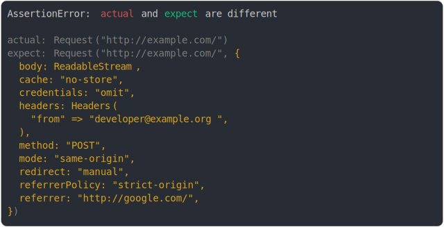
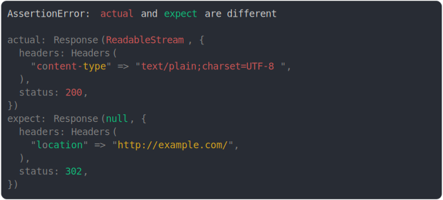

# fetch.md

<sub>
  Generated by <a href="https://github.com/jsenv/core/tree/main/packages/independent/snapshot">@jsenv/snapshot</a> executing <a href="../fetch.test.js">../fetch.test.js</a>
</sub>

## abort signal pending vs aborted

```js
const expectAbortController = new AbortController();
expectAbortController.abort("toto");
assert({
  actual: new AbortController().signal,
  expect: expectAbortController.signal,
});
```


## request url diff

```js
assert({
  actual: new Request("https://foo.com"),
  expect: new Request("https://bar.com"),
});
```


## request with custom options

```js
assert({
  actual: new Request("http://example.com", {
    cache: "default",
    credentials: "same-origin",
    destination: "",
    method: "GET",
    mode: "cors",
    priority: "auto",
    redirect: "follow",
    referrerPolicy: "",
    referrer: "about:client",
  }),
  expect: new Request("http://example.com", {
    body: '{"foo": "bar"}',
    cache: "no-store",
    credentials: "omit",
    destination: "document",
    headers: { from: "developer@example.org" },
    method: "POST",
    mode: "same-origin",
    priority: "high",
    redirect: "manual",
    referrerPolicy: "strict-origin",
    referrer: "http://google.com",
  }),
  MAX_CONTEXT_AFTER_DIFF: 10,
  MAX_CONTEXT_BEFORE_DIFF: 10,
  MAX_DEPTH_INSIDE_DIFF: 5,
});
```



## request abort signal pending vs aborted

```js
const expectAbortController = new AbortController();
expectAbortController.abort("toto");
assert({
  actual: new Request("http://example.com", {
    signal: new AbortController().signal,
  }),
  expect: new Request("http://example.com", {
    signal: expectAbortController.signal,
  }),
});
```


## response body diff

```js
assert({
  actual: {
    a: new Response("foo"),
    b: true,
  },
  expect: {
    a: new Response("bar"),
    b: false,
  },
});
```


## response status diff

```js
assert({
  actual: new Response("", {
    status: 200,
  }),
  expect: new Response("", {
    status: 400,
  }),
});
```


## response prop diff

```js
assert({
  actual: new Response("", {
    status: 200,
    statusText: "",
    type: "basic",
  }),
  expect: new Response("", {
    status: 400,
    statusText: "Bad request",
    headers: {
      "content-length": "0",
    },
    type: "opaque",
  }),
  MAX_CONTEXT_BEFORE_DIFF: 8,
  MAX_CONTEXT_AFTER_DIFF: 8,
});
```


## redirected response

```js
assert({
  actual: new Response("", { status: 200 }),
  expect: Response.redirect("http://example.com"),
});
```

