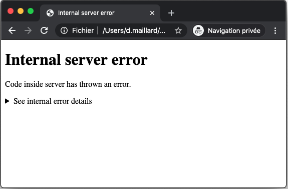
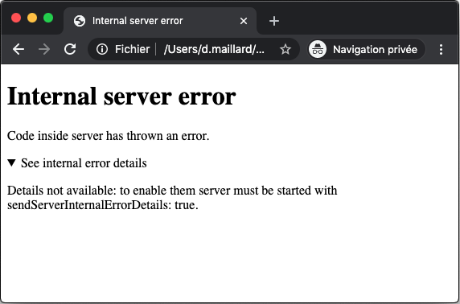

# Error handling

Any error thrown will be gracefully handled by _@jsenv/server_ and produce a 500 response.

```js
import { startServer } from "@jsenv/server"

await startServer({
  services: [
    {
      handleRequest: async () => {
        throw new Error("foo")
      },
    },
  ],
})
```

# Server internal error

A server internal error is when an error is thrown inside [requestToResponse](../handling_requests/handling_requests.md#requestToResponse). When it happens a function becomes responsible to turn the error into an http response. This function is called _errorToResponse_.

## errorToResponse

_errorToResponse_ is an async function responsible to generate response for error thrown during server execution.
There is a default value for this parameter visible at [src/error_to_response_default.js](../../src/error_to_response_default.js).

The default _errorToResponse_ value will respond with a generic error page.

```js
import { startServer } from "@jsenv/server"

await startServer({
  services: [
    {
      handleRequest: () => {
        throw new Error("test")
      },
    },
  ],
})
```





By default error details are not available, use _sendErrorDetails_ to enable them.

```js
import { startServer } from "@jsenv/server"

await startServer({
  services: [
    jsenvServiceErrorHandler({ sendErrorDetails: true }),
    {
      requestToResponse: () => {
        throw new Error("test")
      },
    },
  ],
})
```


You can customize this behaviour by passing your own _errorToResponse_.
This function is asynchronous and receive `error` as first parameter.
It can also access _request_ by destructuring its second parameter.

```js
import { startServer } from "@jsenv/server"

const errorToThrow = new Error("toto")

await startServer({
  services: [
    {
      handleRequest: () => {
        throw errorToThrow
      },
    },
    {
      handleError: (error, { request }) => {
        error === errorToThrow // true
        const body = `An error occured: ${error.message}`
        return {
          status: 500,
          headers: {
            "content-type": "text/plain",
            "content-length": Buffer.byteLength(body),
          },
          body,
        }
      },
    },
  ],
})
```
